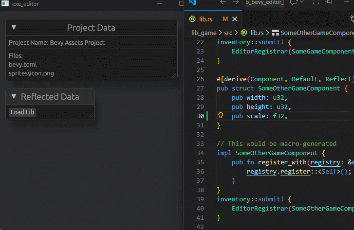

# Architecture

Bevy's editor, like the rest of Bevy, is fundamentally designed to be modular, reusable, and robust to weird use patterns.
But at the same time, a new user's initial experience should be polished, reasonably complete and ready to jump into.

These goals are obviously in tension, and to thread the needle we need to think carefully about our project architecture, both organizationally and technically.

So far, we've agreed upon the following architecture:

- the Bevy editor is a binary application made using `bevy`, and `bevy_ui`
- the Bevy editor will live in the main Bevy repo, and must be updated and fixed as part of the ordinary development process
  - as a large binary project, it represents a great proving ground for how changes will impact users
  - as an important part of Bevy users' workflow, it's important that we don't break it!
  - as a consequence, the Bevy editor cannot rely on any crates that themselves rely on `bevy`: they are not kept up to date with `main`
  - fixing the editor before each release is much more difficult, requiring diverse expertise and a large volume of changes all at once
  - note: until we have an MVP: the editor work is done outside of the main repo, and tracks `main` on an as-updated basis
- functionality that is useful without a graphical editor should be usable without the editor
  - project creation functionality should live in the `bevy_cli`, and be called by the editor
  - asset preprocessing steps should be standalone tools whenever possible, which can then be called by the `bevy_cli` (and then the editor)
- the foundational, reusable elements of the `bevy_editor` should be spun out into their own crates once they mature, but are best prototyped inside of the code for the specific binary application
  - UI widgets, an undo-redo model, preferences, viewport widgets, a node graph abstraction and more all great candidates for this approach
- self-contained GUI-based development tools should be self-contained `Plugin`s which can be reused by projects without requiring the Bevy editor binary
  - for example: an asset browser, entity inspector or system visualization tools
- the editor will not try and inspect the running process: instead, users will be encouraged to reuse modular dev tools from the editor, `bevy_dev_tools` and the broader ecosystem by compiling them into their own project under a per-project `dev_tools` feature flag
  - we should still develop, ship and promote powerful, polished tools for these use cases!
  - this is significantly simpler and offers more flexibility to users around customized workflows

  ## Open questions

These questions are pressing, and need serious design work.

- how do we distribute the Bevy editor?
  - do users need to have a local working copy of the Rust compiler to use the editor effectively?
- how does the Bevy editor communicate with the Bevy game to enable effective scene editing with user-defined types?
- how should undo-redo be handled?

## Extensions

These questions are less pressing, but deserve investigation to ensure we can support more advanced user needs.

- do we need a launcher?
  - are users able to use versions of the Bevy editor that are newer (or older) than their current project?
- how do we allow users to add and remove non-trivial functionality to the editor?
  - for now they can just fork things,
- how are preferences handled?
  - where are they stored?
  - how are they shared between projects?
  - how are they shared between team members?
- can the Bevy editor play nicely with a hotpatched type definitions for things like components?

# Proposals

## [recatek/demo_bevy_editor_structure](https://github.com/recatek/demo_bevy_editor_structure)

A proof of concept working prototype for how a game using Bevy's editor may be organized.

### Overview

This example structure demonstrates a Bevy editor in a workspace with four key parts (all names are bikesheddable).

#### Game Library (lib_game)

The game library is the heart of the game project, and may link in multiple other crates. This is likely to be the largest crate in a game project. Rather than building a game `App`, the game is built as a `Plugin` that adds all of the necessary plugins, resources, and components to the host application that uses it. This library is built as both a Rust `staticlib` and Rust `dylib` (not `cdylib`).

#### Game Executable (exe_game)

This is a shell/host executable for `lib_game`. The `exe_game` source likely contains little code of its own, though it may have some platform-specific code or other things the editor won't need like Steam integration. Most of its logic is pulled in from the plugin in `lib_game`, to which it is *statically* linked. The `exe_game` mostly exists to pull in the static `lib_game` and bootstrap it into a bevy executable which can then be distributed to players or run locally for playtesting.

#### Editor Executable (exe_editor)

This is the editor executable. Its `main.rs` contains boilerplate code for building an editor app and pointing it to both the `lib_game` artifact and the root of the assets directory (if necessary). Unlike `exe_game`, `exe_editor` *dynamically* loads `lib_game` and pulls `bevy_reflect` type registration information from it. This allows the dylib to be unload and reloaded without closing the editor.

For this purpose, the `exe_editor` contains a dedicated `TypeRegistry` separate from the global Bevy `TypeRegistry` due to the need to clear and reload it when the `lib_game` dylib changes[^1]. The use of a dylib here means that, for Rust ABI reasons, `exe_editor` and `lib_game` must be built on the same machine, compiler, and bevy version. However, this is likely to be the case in general. Designers, artists, and other content creators who don't need to edit code can still (likely) work from a CI-built editor/dylib pairing.

[^1]: We may want to keep an FFI-safe copy of the prior TypeRegistry around in order to help with cleaning up version mismatch changes in existing data as struct information is altered on reload.

#### Assets Directory and bevy.toml

The `assets` directory now lives in the workspace root as opposed to inside of a crate. Additionally, there is now a `bevy.toml` file that contains additional project metadata. In this example, `bevy.toml` lives in the `assets` directory and is mainly used for asset configuration, similar to a `project.godot` file. However, this could be altered to live at the workspace root alongside `Cargo.toml`. There are pros/cons to each approach.

### Additional Workflow Considerations

There are some elements not covered in this example, but worth mentioning:

#### .bevyignore

We should have a file similar to `.gitignore` that would omit files from being included in the editor's project tree or any other behing-the-scenes file touching/analysis the editor does. BurntSushi's [ignore crate](https://github.com/BurntSushi/ripgrep/tree/master/crates/ignore) has a `.gitignore` implementation we can use here.

#### Building `lib_game`

Though it isn't included here, it's feasible that `exe_editor` could rebuild and automatically reload `lib_game` as needed when changes are detected. At the very least, it should build `lib_game` on startup if the dylib is not found.

#### Launcher Interaction

To be made aware of this editor executable instance, the launcher would point to either the `bevy.toml` file or the `Cargo.toml` file for either the workspace root or the `exe_editor` crate. The launcher could build (if necessary) the editor and open its executable. The editor would take it from there. The project name and version would come from either the `Cargo.toml` or `bevy.toml` file. Note that code and content may have different versions, especially if non-technical artists/designers/etc. are iterating on content for builds using fixed prebuilt editor versions.

#### .bevy/config.toml

A bevy-specific analogue to `.cargo/config.toml` that contains editor settings. This should follow the same [hierarchical structure](https://doc.rust-lang.org/cargo/reference/config.html#hierarchical-structure) that Cargo does (with some bugs fixed) to allow for project-level and user-level settings configuration. VSCode does something similar here -- it's a common pattern nowadays.

### Proposed Question Closure

- How do we distribute the editor?

  - For now, we do not distribute the editor as an executable. Instead, the editor is built locally like a Bevy `App` is. There is room for future improvement here but the main limitation is Rust ABI. For teams to internally distribute their own prebuilt editor to nontechnical content authors, an editor executable and game dylib can be prebuilt from the same machine and packaged together, and ABI compatibility should be preserved.

- How does the Bevy editor communicate with the Bevy game to enable effective scene editing with user-defined types?

  - Play-in-Editor functionality is a critically valuable "killer app" feature and should be accounted for, but not immediately built. This approach does open the door to the editor hosting a running game in its own thread(s) in-process and manipulating it directly in memory via reflection. However, this is a considerable undertaking. BRP is an alternative, but likely would not scale as well as staying in-process (recatek's note: This is a hot topic and I have strong opinions and past work experience here, but will pen them later/elsewhere).

- How do we allow users to add and remove non-trivial functionality to the editor?

  - Because the editor is its own `exe_editor` crate, extension plugins would be added there as an entrypoint. The user owns their own local editor "shell" crate and builds the editor from some boilerplate, similar to how a normal Bevy `App` is built. They can hack away at the editor with extensions here.

- How are preferences stored?

  - See `.bevy/config.toml` above.

- Can the Bevy editor play nicely with a hotpatched type definitions for things like components?

  - Yes, using this approach, the editor can live-reload the `lib_game` dylib and update its view of the `TypeRegistry` at runtime. A proof of concept is included in the linked repository. This does have ABI concerns, but the only real alternative for live-reloading is hotpatching, and that seems even more risky. There is a `stable_abi` crate, but it does not support unloading, nor does it plan to from their readme.